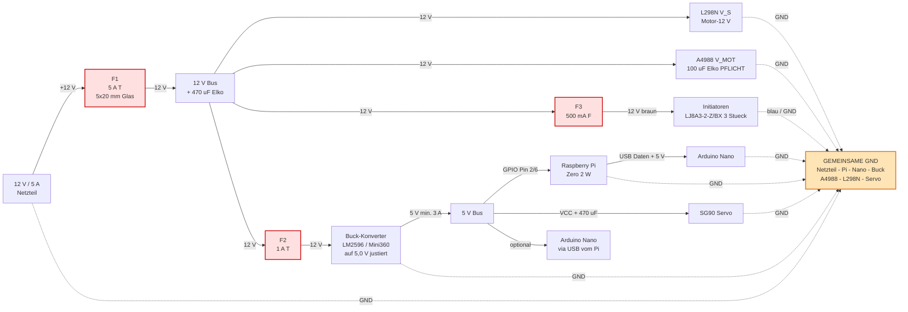
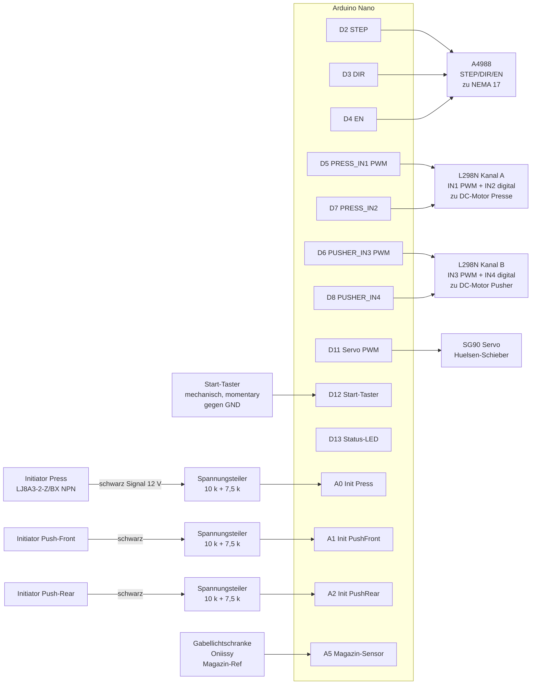
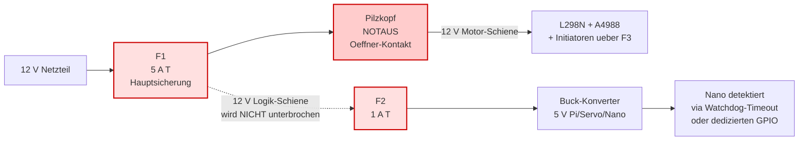

# Verdrahtung & Schaltpläne

Alle Diagramme als Mermaid (rendern direkt auf GitHub) plus ASCII-Detailskizzen
für die kniffligen Stellen (Spannungsteiler, Servo-Entkopplung).

> **Quelle der Wahrheit für Pin-Nummern:** [`firmware/nano/src/pins.h`](../firmware/nano/src/pins.h)
> **Bauteilliste & Material:** [`../CLAUDE.md`](../CLAUDE.md)

---

## 1. Stromversorgung (Power Distribution)



### Sicherungs-Konzept

```
                                                                   ┌─► L298N (Motoren)
                                                                   │
12 V Netzteil ─►【F1: 5 A T, 5×20 mm Glas】──► 12 V-Bus ────────────┼─► A4988 (Stepper)
                  in Halter mit Schraubklemmen,                    │
                  unmittelbar nach PSU-Ausgang                     │
                                                                   ├─►【F2: 1 A T】─► Buck → Pi/Servo
                                                                   │
                                                                   └─►【F3: 500 mA F】─► Initiatoren-12 V
```

| Sicherung | Wert | Charakteristik | Schutzobjekt | Begründung |
|---|---|---|---|---|
| **F1 Hauptsicherung** | 5 A T (träge) | 5×20 mm Glas | Verkabelung 12 V-Bus, gegen PSU-Ausfall der OCP | passt zum 5-A-Netzteil; *träge* wegen Motor-Anlaufstrom (NEMA + 2× DC + Buck-Cap-Ladung gleichzeitig kann kurz > 4 A ziehen) |
| **F2 Buck-Eingang** | 1 A T | 5×20 mm Glas | Pi + Servo + Logik | Pi+Servo zieht ≤ 700 mA; trennt Logikseite, falls Motor-Pfad einen Defekt hat |
| **F3 Initiator-Schiene** | 500 mA F (flink) | 5×20 mm Glas | Sensor-Verkabelung | 3 Sensoren ziehen je ~10 mA; flink, weil dahinter keine induktive Last hängt |

### Warum **Glas**, nicht keramisch?

- **U = 12 V DC**: der Lichtbogen erlischt ohnehin schnell, sobald der Sicherungsdraht durch ist. Keramik-HBC ist für 230 V AC und Kurzschluss-Ströme > 35 A relevant — bei dir nicht der Fall.
- **I_short** ist durch das Schaltnetzteil auf ~10–25 A begrenzt → weit unter dem Glas-Abschaltvermögen (typ. 35 A @ 250 V AC).
- **Keramik** lohnt sich erst bei: AC-Netzseite (vor dem 12-V-PSU), oder wenn du auf Bleibatterie / 4S LiPo umsteigst (Kurzschluss > 100 A möglich).

### Alternative: selbstrückstellende Polyfuses (PTC)

Wenn dir Sicherungswechsel zu lästig sind:

| Position | Bauteil | Trip-Strom | Hinweis |
|---|---|---|---|
| 12 V Hauptlinie | Bourns MF-R500 | 5 A | trippt langsamer (Sekunden), kühlt von selbst zurück |
| Buck-Eingang | Bourns MF-R110 | 1,1 A | gleiches Verhalten |

Nachteil: ungenauer als Schmelzsicherungen, langsamerer Trip — okay als "soft fuse" zusätzlich zu F1, **aber nicht als Ersatz für F1**, weil sie im Kurzschluss zu langsam sind.

### Wichtige Regeln

| Regel | Warum |
|---|---|
| **F1 unmittelbar nach PSU-Ausgang** (nicht erst nach 1 m Kabel) | Sicherung schützt das Kabel — wenn das Kabel vor der Sicherung schmort, hat sie nichts genützt |
| **Sicherungshalter mit Schraubklemmen**, kein Steckhalter | DIY-Vibrationen lockern Stecker; lose Sicherung = Lichtbogen |
| **Buck-Konverter VOR Anschluss auf exakt 5,0 V justieren** (Multimeter!) | werkseitig oft auf 1,2 V — würde Pi/Servo grillen |
| **A4988 V_MOT: 100 µF Elko zwingend** zwischen V_MOT und GND, < 5 cm vom IC | sonst zerstören Spannungsspitzen den Treiber |
| **L298N: 470 µF Elko** an 12 V-Eingang | DC-Motor-Anlaufstrom dämpfen |
| **Servo NICHT vom L298N-5 V-Ausgang** speisen | bricht unter Motorlast ein, Servo zappelt |
| **Servo VCC: 470 µF Elko direkt an VCC↔GND** | Servo-Anlaufstrom |
| **ALLE GNDs verbinden** (Sternpunkt am Netzteil) | sonst funktionieren Steuersignale unzuverlässig |
| **Pi NICHT über Micro-USB** speisen | Polyfuse begrenzt → Brownout. Statt: GPIO Pin 2 (5 V) + Pin 6 (GND) |
| **Bei AC-Netzseite Keramik-Sicherung verwenden** (im 12-V-Netzteil verbaut, sonst extern primärseitig) | für 230 V AC ist Keramik-HBC Pflicht (VDE/CE) — Glas würde Lichtbogen weiterführen |

---

## 2. Signalverdrahtung Arduino Nano



---

## 3. Initiator-Spannungsteiler (KRITISCH)

NPN-Initiatoren geben das Signal als **12 V Pull-up** aus → würde 5 V-Eingang
des Nano sofort zerstören. Spannungsteiler-Verhältnis:

```
U_out = U_in · R2 / (R1 + R2)
      = 12 V · 7,5 kΩ / (10 kΩ + 7,5 kΩ)
      = 12 V · 7,5 / 17,5
      ≈ 5,14 V       ← noch innerhalb 5 V-Toleranz des Nano (max 5,5 V)
```

### ASCII-Schaltbild pro Sensor (3× identisch für Press / PushFront / PushRear)

```
  Initiator LJ8A3-2-Z/BX oder LJ12A3-4-Z/BX (NPN, 12 V)
  ┌──────────────────────┐
  │  braun  ──────────── │ ◄──── +12 V Versorgung (über F3)
  │  blau   ──────────── │ ◄──── GND (gemeinsame Masse!)
  │  schwarz ─── Signal  │
  └──────────────┬───────┘
                 │
                 ●  Sensor inaktiv → ~12 V (interne LED wirkt als Pull-up)
                 │  Sensor aktiv (Metall vor Sensor) → 0 V (zieht auf GND)
                 │
                 ▼  ── verdrilltes Kabel zum Nano ──
                 ▼     (Schwarz + Blau twisten gegen EMV)
                 │
        ┌────────●────────┐  ◄── Spannungsteiler nahe AM NANO platzieren,
        │                 │      nicht am Sensor (12 V auf Kabel = robust)
       ┌┴┐                │
       │ │ R1 = 10 kΩ     │
       │ │ (1/4 W)        │
       └┬┘                │
        │                 │
        ●─────────────────●──────► A0 / A1 / A2 am Nano
        │                 │
       ┌┴┐               ┌┴┐
       │ │ R2 = 7,5 kΩ   │ │ C = 47 nF Keramik
       │ │               │ │ (parallel zu R2 → EMV-Filter)
       └┬┘               └┬┘
        │                 │
        ●─────────────────●
        │
       ─┴─  GND (Sternpunkt)
```

> **Logik im Code:** `INIT_TRIGGERED_LEVEL = LOW`
> ([`firmware/nano/src/config.h`](../firmware/nano/src/config.h))
> Sensor "sieht" Metall → Output zieht auf GND → Spannungsteiler liefert 0 V → `digitalRead == LOW`.

### Was beim Spannungsteiler beachten

| Punkt | Empfehlung | Warum |
|---|---|---|
| **Position** | Widerstände + C **am Nano-Pin**, nicht am Sensor | 12 V-Signal auf der Leitung → besseres SNR gegen Motor-EMI |
| **R-Werte** | 10 kΩ + 7,5 kΩ (Nano) bzw. 10 kΩ + 3,9 kΩ (ESP32) | erprobt, P_dissipation < 5 mW |
| **R-Toleranz** | 5 % reicht (Standardwiderstand) | 1 % nur für maximalen Geiz an Genauigkeit |
| **R-Leistung** | 1/4 W (250 mW) — billige Standardware | tatsächliche Belastung ~5 mW, 50× Reserve |
| **Filter-C** | **47 nF Keramik parallel zu R2** | dämpft Motor-PWM-Stör­spitzen (~1–30 kHz), Sensor-Latenz nur ~3 ms |
| **Kabel** | Sensor-Kabel verdrillen (schwarz + blau) | Common-Mode-EMI wird ausgemittelt |
| **GND** | Sensor-GND auf den **Sternpunkt** am Netzteil, nicht "irgendwo" | sonst verschiebt Sensor-Strom den Mittenabgriff |
| **Pull-up** | nicht zwingend (LED-Pull-up im Sensor reicht meist) | Falls "schwarz" im Leerlauf < 10 V: 4,7 kΩ extern von schwarz nach +12 V |

### Test vor dem Anschluss am Nano (Pflicht-Checkliste)

```
□ 1) Sensor mit 12 V versorgen (braun an +12 V via F3, blau an GND)
□ 2) Spannungsteiler aufbauen (R1, R2, C), GND mit Sensor-GND verbinden
□ 3) Multimeter zwischen Mittenabgriff und GND messen
□ 4) Sensor inaktiv: Erwartung 5,0–5,2 V (kein Metall davor)
□ 5) Sensor aktiv: Erwartung 0,0–0,2 V (Schraubenzieher 1–2 mm davor)
□ 6) Sensor mehrfach aktivieren, beide Werte stabil reproduzierbar
□ 7) Optional: Funktion mit laufendem Motor in der Nähe verifizieren
   (Stör­einflüsse vorhanden, falls C zu klein gewählt)
□ 8) ERST DANN Verbindung zu A0/A1/A2 am Nano herstellen
```

> Wenn Schritt 4 statt 5 V dauerhaft 12 V zeigt: R1/R2 vertauscht — würde
> den Nano-Pin sofort zerstören. **Fehler hier ist 100 % vermeidbar.**

### Filter-Kondensator: Wahl der Kapazität

| C-Wert | Grenzfrequenz f_c | Sensor-Latenz | Geeignet für |
|---|---|---|---|
| 10 nF | ~3,7 kHz | ~0,4 ms | Schnelle Sensor-Reaktion, leichte EMV |
| **47 nF** ← Default | ~800 Hz | ~2 ms | Mittelweg, gut gegen Motor-PWM 1–30 kHz |
| 100 nF | ~370 Hz | ~4 ms | Maximale Filterung, langsamere Reaktion |
| 1 µF | ~37 Hz | ~40 ms | Nur wenn Polling sehr langsam (z. B. 1 Hz) |

> **f_c-Berechnung:** `f_c = 1 / (2π · R_T · C)` mit `R_T = R1 ∥ R2 ≈ 4,3 kΩ`

### Für ESP32 (Übergangslösung, 3,3 V-Logik)

```
R1 = 10 kΩ, R2 = 3,9 kΩ, C = 47 nF (gleiche Wahl wie Nano)
U_out = 12 V · 3,9 / 13,9 ≈ 3,37 V    ← innerhalb 3,3 V-Toleranz (max 3,6 V)
```

---

## 4. A4988 Schrittmotor-Treiber (NEMA 17)

```
                  ┌───────────────────────┐
       12 V ────► │ V_MOT          1B │───┐
                  │              ↓   1A │   ├─► NEMA 17 Spule A
                  │            ╔═════╗  │   │
                  │            ║  IC ║  │   ├─► NEMA 17 Spule B
                  │            ╚═════╝  │   │
                  │                2A │───┘
                  │                2B │
       Nano D2 ─► │ STEP                │
       Nano D3 ─► │ DIR                 │
       Nano D4 ─► │ EN  (LOW = aktiv)   │
                  │ MS1/MS2/MS3 ► offen │  ← Vollschritt; ggf. überbrücken für 1/8 oder 1/16
                  │ RESET ─┐            │
                  │ SLEEP ─┤  verbinden │  ← per Kabelbrücke beide HIGH
                  │        └─ V_DD 5 V  │
                  │ V_DD ───────────── │ ◄── 5 V Logik
                  │ GND ─────────────── │ ◄── GND
                  │ V_MOT GND ───────── │ ◄── GND (Sternpunkt!)
                  └───────────────────────┘
                         │
                       ║ ║  100 µF / ≥ 25 V Elko (low ESR)
                       ║ ║  zwischen V_MOT + GND
                       ─ ─  PFLICHT, < 5 cm vom IC
                        │
                       GND
```

### Elko-Spezifikation am A4988

| Parameter | Wert | Begründung |
|---|---|---|
| **Kapazität** | **≥ 100 µF** (220 µF besser, bis 470 µF sinnvoll) | Datenblatt-Minimum; mehr puffert besser |
| **Spannung** | **≥ 25 V** | 12 V Betriebsspannung, Spikes bis 25 V beim Schalten — 16 V Elko ist **zu knapp** und stirbt |
| **Typ** | Low ESR (z. B. Panasonic FC, Nichicon PW, Rubycon ZL) | A4988 schaltet intern mit 500 kHz, Standard-Elkos haben hier zu hohen ESR |
| **Temperatur** | 105 °C | nicht 85 °C — der A4988 wird im Betrieb warm |
| **Position** | < 5 cm vom V_MOT-Pin, **direkt auf den Treiber-Header** löten | Drahtinduktivität würde sonst die Filterwirkung neutralisieren |

> ⚠️ **16 V-Elko bei 12 V V_MOT:** **NICHT verwenden**. Headroom nur 33 %, beim
> ersten Step-Spike geht der Elko stilistisch zwischen Plopp (leise) und
> Knall (laut) ins Nirwana und nimmt den A4988 mit. Mindestens 25 V ist Pflicht.

### Vref einstellen (vor erstem Anlauf!)

```
Vref-Poti am A4988 mit Multimeter messen (zwischen Poti-Mittenkontakt und GND)
Ziel: Vref = 0,7 ... 1,0 V

Strom pro Spule = Vref / (8 · R_sense)
NEMA 17 (1,5 A nominal): Vref ≈ 0,8 V → I ≈ 1,0 A
```

> **Sicherheits-Reihenfolge:** Erst Vref justieren, dann V_MOT 12 V einschalten,
> dann erst Logik 5 V. Sonst stirbt der Treiber.

---

## 5. L298N Mini-Modul (1,5 A je Kanal, ohne ENA/ENB)

> Verwendetes Modul: kompakte 6-Pin-Variante (V_S, GND, IN1–IN4) ohne ENA/ENB.
> Enable ist intern auf HIGH festverdrahtet. Drehzahl-Regelung läuft daher per
> PWM direkt auf den aktiven IN-Pin ("sign-magnitude PWM").

```
              ┌──────────────────────────────────┐
   12 V ────► │ +12 V                  Out 1 │──► DC-Motor Presse +
              │                        Out 2 │──► DC-Motor Presse −
              │                        Out 3 │──► DC-Motor Pusher +
              │                        Out 4 │──► DC-Motor Pusher −
              │                                  │
   D5 ──────► │ IN1   (PWM, Presse FWD)          │
   D7 ──────► │ IN2   (digital, Presse REV)      │
   D6 ──────► │ IN3   (PWM, Pusher FWD)          │
   D8 ──────► │ IN4   (digital, Pusher REV)      │
              │                                  │
              │ GND ──────────────────────────── │ ◄── GND Sternpunkt
              └──────────────────────────────────┘
                       │
                     ║ ║  470 µF / ≥ 25 V Elko
                     ║ ║  (1000 µF besser, low ESR optional)
                     ─ ─
                      │
                     GND
```

### Elko-Spezifikation am L298N

| Parameter | Wert | Begründung |
|---|---|---|
| **Kapazität** | **≥ 470 µF** (1000 µF empfohlen) | DC-Motoren ziehen 3–5× Nennstrom beim Anfahren — Elko liefert die Spitze |
| **Spannung** | **≥ 25 V** | Drehrichtungswechsel + Bürstenfunken können > 18 V Spikes erzeugen |
| **Typ** | Standard-Elko reicht (PWM nur ~490 Hz) | Low ESR ist nice-to-have, nicht Pflicht wie beim A4988 |
| **Temperatur** | 105 °C | Standard, nicht die billigen 85 °C-Typen |
| **Position** | < 5 cm vom V_S-Pin am Modul | Drahtinduktivität reduzieren |

> Auf den L298N-Mini-Modulen ist meist schon ein **kleiner Elko** (z. B. 47 µF/25 V)
> aufgelötet — der reicht NICHT, ist nur SMD-Notbehelf. Externen 470–1000 µF
> **parallel** dazu, am 12 V-Eingang.

### Optional: Externe Flyback-Dioden 1N5819

Der L298N-Chip hat **interne** Freilaufdioden, die aber langsam sind (Recovery ~1–2 µs). Bei den Mini-Modulen sparen Hersteller die externen Schottkys ein. Nachrüsten verlängert die Lebensdauer:

```
              Out1 ●────●────────● DC-Motor +
                       │
                      ─┴─ 1N5819     Kathode an +12 V
                       ▲             Anode an Motor-Klemme
                      ─┬─
                       │
              Out2 ●────●────────● DC-Motor −

   Pro Motor: 4× 1N5819 (eine an jede der vier Brücken-Kombinationen).
   2 Motoren = 8× 1N5819, ~5 ct/Stück.
```

### Wahrheitstabelle (sign-magnitude PWM)

| IN_a (PWM-Pin) | IN_b (digital) | Verhalten |
|---|---|---|
| `analogWrite(x)` mit x > 0 | LOW | Motor vorwärts mit Drehzahl x/255 |
| 0 (LOW) | HIGH | Motor rückwärts mit voller Drehzahl |
| 0 (LOW) | LOW | Motor gebremst (kurzgeschlossen gegen GND) |
| HIGH (255) | HIGH | beide Brücken HIGH → Bremse gegen V_S |

> **Coast (Freilauf) gibt es nicht** mit dieser Beschaltung — der Enable-Eingang
> liegt intern fest auf HIGH. Stop = aktive Bremse.

> **D9 und D10 sind frei** (waren bei der Standard-L298N-Variante ENA/ENB).
> Können später für I²C-Display, zusätzliche Endschalter o. ä. genutzt werden,
> aber **PWM** ist auf D9/D10 nicht möglich, solange `Servo.h` läuft (Servo
> blockiert Timer1, der die PWM auf D9/D10 erzeugt).

---

## 6. Servo-Entkopplung

```
                              ╔═══════════════╗
   Buck 5 V ──────●──────────╣ VCC (rot)     ║
                  │           ║               ║
                ║ ║           ║   SG90 Servo  ║
                ║ ║ 470 µF    ║  (Hülsenschieber)║
                ─ ─ ≥ 10 V    ║               ║
                  │           ║               ║
   GND ───────────●──────────╣ GND (braun)   ║
                              ║               ║
   Nano D11 ─────────────────╣ Signal (orange)║
                              ╚═══════════════╝
```

### Elko-Spezifikation am Servo

| Parameter | Wert | Begründung |
|---|---|---|
| **Kapazität** | **≥ 470 µF** (bis 2200 µF unproblematisch) | Servo-Anlaufstrom 0,5–1 A für ~5 ms |
| **Spannung** | **≥ 10 V** (16 V oder 25 V auch fein) | 5 V Servoversorgung, Spikes klein — 10 V genügt |
| **Typ** | Standard-Elko, kein Low ESR nötig | DC-Motor mit niedriger Schaltfrequenz |
| **Position** | < 3 cm vom Servo-VCC-Pin, **NICHT** am Buck | Wire inductance würde lokale Versorgung neutralisieren |

> Der **Elko direkt am Servo** (nicht erst am Buck) ist entscheidend — die kurze
> Stromspitze beim Servo-Anlauf bricht sonst die 5 V-Schiene ein und der Pi
> bootet neu.

> **Bonus:** Mit 1000+ µF am Servo brauchst du keinen separaten Bulk-Cap am
> Buck-Ausgang — der Servo-Elko puffert die ganze 5 V-Schiene mit, falls Pi
> und Servo räumlich nahe beieinander liegen.

---

## 7. Start-Taster (mechanisch, momentary)

```
                                    +5 V (intern)
                                       │
                                      ┌┴┐
                                      │ │  ~30 kΩ
                                      │ │  (interner
                                      │ │  Pull-up im
                                      │ │  ATmega328)
                                      └┬┘
                                       │
   Nano D12 ◄──────────────────────────●──────────● Taster Pin 1
                                                  │
                                                 ─┤   Drucktaster
                                                  │   (Schließer,
                                                 ─┤    momentary)
                                                  │
   Nano GND ──────────────────────────────────── ● Taster Pin 2
```

**Logik:**
- **Ungedrückt:** Pin-Eingang über internen Pull-up auf HIGH gezogen (~5 V).
- **Gedrückt:** Taster schließt → Eingang direkt an GND → LOW.
- `digitalRead(PIN_BUTTON) == LOW` → Taster ist gedrückt.

**Vorteile gegenüber TTP223:**
- robust gegen Tabakstaub und EMI von DC-Motoren
- kein zusätzliches Modul / keine Versorgungsleitung
- nur zwei Kabel (Signal + GND) statt drei

**Geeignete Bauarten:**
- Mini-Tactile-Tactile-Button auf Steckbrett (für Tests)
- Panel-Mount-Drucktaster 12 mm oder 16 mm (mit Verschraubung am Gehäuse)
- Pilzkopf-Taster mit Schließer-Kontakt (NICHT als Notaus verwenden — der hat
  einen Öffner und unterbricht 12 V hardwareseitig)

**Software-Entprellung:** Mechanische Taster prellen ~1–10 ms beim Schließen.
Konstante `BUTTON_DEBOUNCE_MS = 50` in [`config.h`](../firmware/nano/src/config.h)
ist als Vorgabe für künftiges Edge-Detection im Pi reserviert. Bei reinem
Status-Polling (alle 50 ms) ist Prellen meist unkritisch — die nächste Abfrage
sieht schon den stabilen Zustand.

### Externer Pull-up — brauche ich keinen!

Der interne Pull-up des ATmega328 (~30 kΩ) ist **im Chip integriert** und wird
per Software aktiviert (`pinMode(PIN_BUTTON, INPUT_PULLUP)`). **Kein externer
Widerstand nötig.**

Externen Pull-up nur ergänzen, wenn:

- Kabel zum Taster > 1 m lang (EMV-Anfälligkeit)
- Industrielle Umgebung mit hoher Stör­einstrahlung

Dann **4,7–10 kΩ** zwischen D12 und +5 V — **kein 30 kΩ**, der wäre nur ein
Doppel des internen Pull-ups ohne echten Mehrwert.

---

## 8. Notaus + Sicherungen (Hardware-seitig, geplant)



### Reihenfolge der Schutzelemente

```
PSU ──► [F1 Hauptsicherung] ──┬──► [NOTAUS-Schalter] ──► Motor-12V (L298N, A4988, F3→Initiatoren)
                              │
                              └──► [F2] ──► Buck → 5V (Pi, Servo, Nano-Logik)
```

| Element | Schützt gegen | Was passiert beim Auslösen |
|---|---|---|
| **F1** | Kurzschluss / Defekt irgendwo im 12 V-Bus | Maschine **komplett** stromlos (auch Pi) |
| **NOTAUS** | bewusst durch Bediener | nur Motorseite stromlos; Pi/Nano laufen weiter, melden Notaus-Zustand |
| **F2** | Kurzschluss im Buck oder Pi/Servo/Nano | Logikseite aus, Motorseite läuft theoretisch weiter — aber Watchdog im Nano triggert nach 5 s "alle Motoren aus", weil der Pi nicht mehr antwortet |
| **F3** | Verdrahtungsfehler an Initiatoren (z. B. 12 V auf Signal-Eingang) | Sensoren tot, Stopfsequenz pausiert; Motoren bleiben an, müssen vom Pi kontrolliert gestoppt werden |

> Wichtig: Notaus unterbricht **nur die 12 V-Motorschiene**, nicht die 5 V-Logik.
> So bleibt der Pi an, kann den Notaus-Zustand loggen und die App informieren.
> Der Nano merkt am Wegfall der INIT-Signale (12 V weg) bzw. am Watchdog (5 s
> kein Pi-Befehl wird ohnehin ausgewertet).
>
> **F1 sitzt VOR dem Notaus**, damit auch bei verschweißtem Notaus-Kontakt
> (Worst Case) noch ein Schutz greift.

---

## Verwandte Dokumente

- [`pinout.md`](pinout.md) — vollständige Pin-zu-Bauteil-Tabelle
- [`protocol.md`](protocol.md) — Serial-Befehle Pi ↔ Nano
- [`../CLAUDE.md`](../CLAUDE.md) — Projektkontext & Materialliste
- [`../firmware/nano/src/pins.h`](../firmware/nano/src/pins.h) — Pin-Defines im Code
