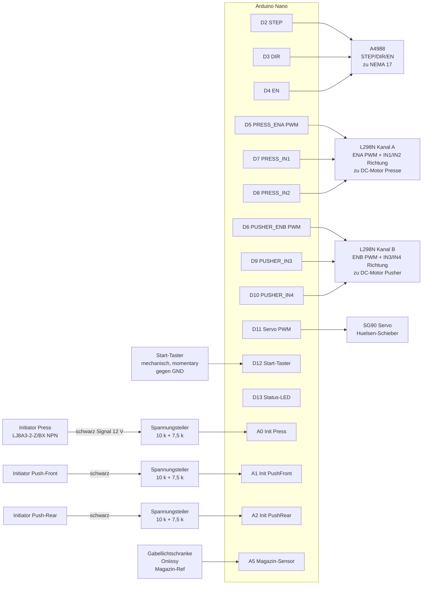
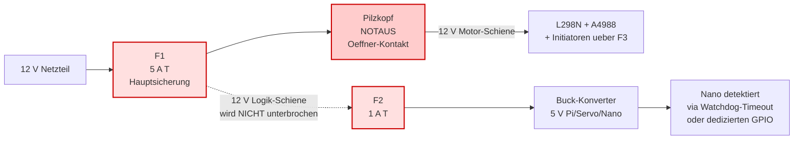

# Verdrahtung & Schaltpläne

Alle Diagramme als Mermaid (rendern direkt auf GitHub) plus ASCII-Detailskizzen
für die kniffligen Stellen (Spannungsteiler, Servo-Entkopplung).

> **Quelle der Wahrheit für Pin-Nummern:** [`firmware/nano/src/pins.h`](../firmware/nano/src/pins.h)
> **Bauteilliste & Material:** [`../CLAUDE.md`](../CLAUDE.md)

---

## 1. Stromversorgung (Power Distribution)


### Sicherungs-Konzept

```
                                                                   ┌─► L298N (Motoren)
                                                                   │
12 V Netzteil ─►【F1: 5 A T, 5×20 mm】──► 12 V-Bus ─────────────────┼─► A4988 (Stepper)
                  in Halter mit Schraubklemmen,                    │
                  unmittelbar nach PSU-Ausgang                     │
                                                                   ├─►【F2: 1 A T】─► Buck → Pi/Servo
                                                                   │
                                                                   └─►【F3: 500 mA F】─► Initiatoren-12 V
```

| Sicherung | Wert | Charakteristik | Schutzobjekt | Begründung |
|---|---|---|---|---|
| **F1 Hauptsicherung** | 5 A T (träge) | 5×20 mm | Verkabelung 12 V-Bus, gegen PSU-Ausfall der OCP | passt zum 5-A-Netzteil; *träge* wegen Motor-Anlaufstrom (NEMA + 2× DC + Buck-Cap-Ladung gleichzeitig kann kurz > 4 A ziehen) |
| **F2 Buck-Eingang** | 1 A T | 5×20 mm | Pi + Servo + Logik | Pi+Servo zieht ≤ 700 mA; trennt Logikseite, falls Motor-Pfad einen Defekt hat |
| **F3 Initiator-Schiene** | 500 mA F (flink) | 5×20 mm | Sensor-Verkabelung | 3 Sensoren ziehen je ~10 mA; flink, weil dahinter keine induktive Last hängt |

### Glas oder Keramik — beides funktioniert

Bei **12 V DC** sind Glas- und Keramik-Schmelzsicherungen **elektrisch
gleichwertig**. Beides geht.

| | Glas | Keramik (HBC) |
|---|---|---|
| Preis pro Stück | ~0,30 € | ~1–2 € |
| Abschaltvermögen | 35 A @ 250 V AC | 1500 A @ 250 V AC |
| Lichtbogen-Verhalten | erlischt bei 12 V DC sowieso ohne Probleme | komplett gelöscht durch Sandfüllung |
| Verfügbarkeit | überall (Reichelt, Conrad, Amazon, Auto-Zubehör) | Spezial-Elektronik-Handel |
| Mein-Bauteil-Box-Faktor | meist da | seltener da, aber wenn → super |

- **Du hast Glas zur Hand?** Nimm Glas, völlig ausreichend.
- **Du hast Keramik zur Hand?** Nimm Keramik, sogar ein bisschen sicherer.
- **Beides nicht?** Bestelle Glas — günstiger, gleichwertig.

> **Wichtig:** Beide Typen müssen den **gleichen Wert** und die **gleiche
> Charakteristik** haben (T = träge, F = flink). Eine Keramik-5A-T verhält sich
> beim Auslösen identisch zu einer Glas-5A-T.

Keramik wird **zwingend** bei: AC-Netzseite (vor dem 12-V-Netzteil) oder
Hochstrom-Versorgung (Bleibatterie / 4S LiPo > 100 A Kurzschluss). Im 12 V-DC-Pfad
dieser Maschine ist es Wahl-Sache.

### Alternative: selbstrückstellende Polyfuses (PTC)

Wenn dir Sicherungswechsel zu lästig sind:

| Position | Bauteil | Trip-Strom | Hinweis |
|---|---|---|---|
| 12 V Hauptlinie | Bourns MF-R500 | 5 A | trippt langsamer (Sekunden), kühlt von selbst zurück |
| Buck-Eingang | Bourns MF-R110 | 1,1 A | gleiches Verhalten |

Nachteil: ungenauer als Schmelzsicherungen, langsamerer Trip — okay als "soft fuse" zusätzlich zu F1, **aber nicht als Ersatz für F1**, weil sie im Kurzschluss zu langsam sind.

### Bus-Verteilung praktisch — WAGO-Klemmen

Für den +12 V-Bus und vor allem den **GND-Sternpunkt** brauchst du eine
ordentliche Verteilung. Steckbrett ist hier **kein** geeignetes Bauteil
(Federkontakt-Widerstand 10–100 mΩ, max ~3 A, lockert sich vibrationsbedingt).

**Empfohlen: WAGO 221 Hebelklemmen** (oder kompatible Hebelklemmen anderer
Hersteller mit gleicher Pol-Anzahl).

| Pole | Beispiel-Modell | Querschnitt | Strom | Einsatzfeld |
|---|---|---|---|---|
| 3-fach | WAGO 221-413 | 0,2–4 mm² | 32 A | lokale Sub-Sternpunkte (z. B. 3× Initiator-blau) |
| 5-fach | WAGO 221-415 | 0,2–4 mm² | 32 A | +12 V-Bus (passt exakt: PSU+, L298N, A4988, F2, F3) |
| 8-fach | WAGO 221-418 | 0,2–4 mm² | 32 A | GND-Sternpunkt (8 Verbraucher) |
| **10-fach** | div. Hebelklemmen | 0,2–4 mm² | 32 A | **Optimum** — eine Klemme für GND, eine für +12 V |

### Verdrahtungsplan mit 2× 10-Pol-Klemme (empfohlen)

**Eine Klemme für GND-Sternpunkt:**

```
   GND-Sternpunkt (10-Pol):
   ┌────┬────┬────┬────┬────┬────┬────┬────┬────┬────┐
   │ 1  │ 2  │ 3  │ 4  │ 5  │ 6  │ 7  │ 8  │ 9  │ 10 │
   └────┴────┴────┴────┴────┴────┴────┴────┴────┴────┘
     │    │    │    │    │    │    │    │    │    │
     │    │    │    │    │    │    │    │    │    └─► Reserve
     │    │    │    │    │    │    │    │    └─────► Nano (optional, kommt via USB-Pi)
     │    │    │    │    │    │    │    └──────────► Pi GND (Pin 6)
     │    │    │    │    │    │    └───────────────► Initiator-blau (3× gebündelt, siehe unten)
     │    │    │    │    │    └────────────────────► Servo GND (braun)
     │    │    │    │    └─────────────────────────► A4988 GND_logic
     │    │    │    └──────────────────────────────► A4988 GND_motor
     │    │    └───────────────────────────────────► L298N GND
     │    └────────────────────────────────────────► Buck VOUT−
     └─────────────────────────────────────────────► PSU − (+ Buck VIN−)
```

**Eine Klemme für +12 V-Bus:**

```
   +12 V-Bus (10-Pol):
   ┌────┬────┬────┬────┬────┬────┬────┬────┬────┬────┐
   │ 1  │ 2  │ 3  │ 4  │ 5  │ 6  │ 7  │ 8  │ 9  │ 10 │
   └────┴────┴────┴────┴────┴────┴────┴────┴────┴────┘
     │    │    │    │    │    │
     │    │    │    │    │    └─► Reserve / Bulk-Cap +
     │    │    │    │    └──────► F3 → Initiator-braun-Schiene
     │    │    │    └───────────► F2 → Buck-Eingang +
     │    │    └────────────────► A4988 V_MOT
     │    └─────────────────────► L298N V_S
     └──────────────────────────► PSU + (über F1)
```

→ Saubere Stern-Topologie, jeder Pfad ein eigener Pin, keine Daisy-Chain.

### Initiator-blau bündeln (Sub-Sternpunkt)

Die 3 blauen Adern der Initiatoren würden 3 Pins belegen — Lösung: **vorher
zusammenfassen** in einem lokalen Sub-Sternpunkt nahe der Sensor-Schiene.

**Variante 1 (sauber): Mini-WAGO 3-Pol als Sub-Sternpunkt**

```
   3× Initiator blau (je 0,25 mm²) → WAGO 221-413 (3-Pol)
                                          │
                                          └─► eine 0,5 mm²-Litze →
                                              Haupt-GND-Klemme Pin 7
```

**Variante 2 (kompakter): 3 Litzen in eine Aderendhülse 1,5 mm²**

```
   3× Initiator blau (je 0,25 mm²) → 4× Aderendhülse 1,5 mm²
                                       (3 Litzen zusammen, gemeinsame Hülse)
                                       → Haupt-GND-Klemme Pin 7
```

→ Variante 1 ist sauberer und beschriftbar. Variante 2 spart das WAGO-Bauteil.

### Verdrahtungsplan mit nur 1× 10-Pol-Klemme

Priorisiere **GND** — wo Sterntopologie kritisch ist. Den +12 V-Bus dann als
Daisy-Chain über die Schraubklemmen der Module, da spielen 50 mV
Spannungsabfall keine Rolle.

```
   1× 10-Pol GND-Sternpunkt (wie oben)
   +12 V als Daisy-Chain:
     PSU+ ──[F1]──● L298N V_S ──● A4988 V_MOT ──● [F2] Buck+ ──● [F3] Init.+

   Aderquerschnitt: 1,0 mm² Hauptlinie, fest in jede Modul-Klemme rein und gleich
   wieder zur nächsten — kein Verteiler nötig dazwischen.
```

### Verdrahtungsplan mit 2× 5-Pol-Klemme (verkettet, Notlösung)

Wenn nur kleinere Klemmen da sind: zwei 5-fach-WAGOs ergeben verkettet einen
8-fach-Stern. Drahtbrücke zwischen je einem Pin der zwei WAGOs (5 cm
1,0 mm² massiv).

```
   GND-Stern (8 Anschlüsse aus 2× 5-Pin-WAGO):

   WAGO #2                            WAGO #3
   ┌────┬────┬────┬────┬────┐         ┌────┬────┬────┬────┬────┐
   │ 1  │ 2  │ 3  │ 4  │ 5  │ ◄────►  │ 1  │ 2  │ 3  │ 4  │ 5  │
   └────┴────┴────┴────┴────┘    ▲    └────┴────┴────┴────┴────┘
                                 │
                          Brücke 1,0 mm²
                          1× Pin pro WAGO
```

### Beschriftung der Klemme

Mit **wasserfestem Marker** direkt auf das transparente Klemmen-Gehäuse,
welcher Pin wozu:

```
   ┌─────┬─────┬─────┬─────┬─────┬─────┬─────┬─────┬─────┬─────┐
   │PSU- │Buck │Buck │L298 │A4988│A4988│Serv │Init │ Pi  │Res. │
   │     │VIN- │VOUT-│GND  │MOT  │LOG  │GND  │blau │GND  │     │
   └─────┴─────┴─────┴─────┴─────┴─────┴─────┴─────┴─────┴─────┘
```

In 6 Monaten beim Debuggen wirst du es dir selbst danken.

### Best Practices

- WAGOs mit Klebepad (Tesa Powerstrips) oder DIN-Schiene am Gehäuse fixieren
- Filzstift-Beschriftung pro Pin: "PSU−", "L298N", "A4988_motor", "A4988_logic", …
- Alle GND-Drähte einzeln in **separate** Pins, **keine Daisy-Chain**
- Querschnitt ≥ 0,75 mm² für Hochstrom-Pfade (PSU, L298N), ≥ 0,5 mm² für Logik

> **Verboten:** Daisy-Chain ("PSU → Buck → Pi → L298N → A4988 → GND") — wenn der
> Press-Motor 3 A zieht, fließen die durch alle vorgelagerten GND-Leitungen →
> 100 mV Massepotential-Verschiebung am Pi → Logikfehler oder USB-Ausfall.

### Wichtige Regeln

| Regel | Warum |
|---|---|
| **F1 unmittelbar nach PSU-Ausgang** (nicht erst nach 1 m Kabel) | Sicherung schützt das Kabel — wenn das Kabel vor der Sicherung schmort, hat sie nichts genützt |
| **Sicherungshalter mit Schraubklemmen**, kein Steckhalter | DIY-Vibrationen lockern Stecker; lose Sicherung = Lichtbogen |
| **Buck-Konverter VOR Anschluss auf exakt 5,0 V justieren** (Multimeter!) | werkseitig oft auf 1,2 V — würde Pi/Servo grillen |
| **A4988 V_MOT: 100 µF Elko zwingend** zwischen V_MOT und GND, < 5 cm vom IC | sonst zerstören Spannungsspitzen den Treiber |
| **L298N: 470 µF Elko** an 12 V-Eingang | DC-Motor-Anlaufstrom dämpfen |
| **Servo NICHT vom L298N-5 V-Ausgang** speisen | bricht unter Motorlast ein, Servo zappelt |
| **Servo VCC: 470 µF Elko direkt an VCC↔GND** | Servo-Anlaufstrom |
| **ALLE GNDs verbinden** (Sternpunkt am Netzteil) | sonst funktionieren Steuersignale unzuverlässig |
| **Pi NICHT über Micro-USB** speisen | Polyfuse begrenzt → Brownout. Statt: GPIO Pin 2 (5 V) + Pin 6 (GND) |
| **Bei AC-Netzseite Keramik-Sicherung verwenden** (im 12-V-Netzteil verbaut, sonst extern primärseitig) | für 230 V AC ist Keramik-HBC Pflicht (VDE/CE) — Glas würde Lichtbogen weiterführen |

---

## 2. Signalverdrahtung Arduino Nano



---

## 3. Initiator-Spannungsteiler (KRITISCH)

NPN-Initiatoren geben das Signal als **12 V Pull-up** aus → würde 5 V-Eingang
des Nano sofort zerstören. Spannungsteiler-Verhältnis:

```
U_out = U_in · R2 / (R1 + R2)
      = 12 V · 7,5 kΩ / (10 kΩ + 7,5 kΩ)
      = 12 V · 7,5 / 17,5
      ≈ 5,14 V       ← noch innerhalb 5 V-Toleranz des Nano (max 5,5 V)
```

### ASCII-Schaltbild pro Sensor (3× identisch für Press / PushFront / PushRear)

```
  Initiator LJ8A3-2-Z/BX oder LJ12A3-4-Z/BX (NPN, 12 V)
  ┌──────────────────────┐
  │  braun  ──────────── │ ◄──── +12 V Versorgung (über F3)
  │  blau   ──────────── │ ◄──── GND (gemeinsame Masse!)
  │  schwarz ─── Signal  │
  └──────────────┬───────┘
                 │
                 ●  Sensor inaktiv → ~12 V (interne LED wirkt als Pull-up)
                 │  Sensor aktiv (Metall vor Sensor) → 0 V (zieht auf GND)
                 │
                 ▼  ── verdrilltes Kabel zum Nano ──
                 ▼     (Schwarz + Blau twisten gegen EMV)
                 │
        ┌────────●────────┐  ◄── Spannungsteiler nahe AM NANO platzieren,
        │                 │      nicht am Sensor (12 V auf Kabel = robust)
       ┌┴┐                │
       │ │ R1 = 10 kΩ     │
       │ │ (1/4 W)        │
       └┬┘                │
        │                 │
        ●─────────────────●──────► A0 / A1 / A2 am Nano
        │                 │
       ┌┴┐               ┌┴┐
       │ │ R2 = 7,5 kΩ   │ │ C = 47 nF Keramik
       │ │               │ │ (parallel zu R2 → EMV-Filter)
       └┬┘               └┬┘
        │                 │
        ●─────────────────●
        │
       ─┴─  GND (Sternpunkt)
```

> **Logik im Code:** `INIT_TRIGGERED_LEVEL = LOW`
> ([`firmware/nano/src/config.h`](../firmware/nano/src/config.h))
> Sensor "sieht" Metall → Output zieht auf GND → Spannungsteiler liefert 0 V → `digitalRead == LOW`.

### Was beim Spannungsteiler beachten

| Punkt | Empfehlung | Warum |
|---|---|---|
| **Position** | Widerstände + C **am Nano-Pin**, nicht am Sensor | 12 V-Signal auf der Leitung → besseres SNR gegen Motor-EMI |
| **R-Werte** | 10 kΩ + 7,5 kΩ (Nano) bzw. 10 kΩ + 3,9 kΩ (ESP32) | erprobt, P_dissipation < 5 mW |
| **R-Toleranz** | 5 % reicht (Standardwiderstand) | 1 % nur für maximalen Geiz an Genauigkeit |
| **R-Leistung** | 1/4 W (250 mW) — billige Standardware | tatsächliche Belastung ~5 mW, 50× Reserve |
| **Filter-C** | **47 nF Keramik parallel zu R2** | dämpft Motor-PWM-Stör­spitzen (~1–30 kHz), Sensor-Latenz nur ~3 ms |
| **Kabel** | Sensor-Kabel verdrillen (schwarz + blau) | Common-Mode-EMI wird ausgemittelt |
| **GND** | Sensor-GND auf den **Sternpunkt** am Netzteil, nicht "irgendwo" | sonst verschiebt Sensor-Strom den Mittenabgriff |
| **Pull-up** | nicht zwingend (LED-Pull-up im Sensor reicht meist) | Falls "schwarz" im Leerlauf < 10 V: 4,7 kΩ extern von schwarz nach +12 V |

### Test vor dem Anschluss am Nano (Pflicht-Checkliste)

```
□ 1) Sensor mit 12 V versorgen (braun an +12 V via F3, blau an GND)
□ 2) Spannungsteiler aufbauen (R1, R2, C), GND mit Sensor-GND verbinden
□ 3) Multimeter zwischen Mittenabgriff und GND messen
□ 4) Sensor inaktiv: Erwartung 5,0–5,2 V (kein Metall davor)
□ 5) Sensor aktiv: Erwartung 0,0–0,2 V (Schraubenzieher 1–2 mm davor)
□ 6) Sensor mehrfach aktivieren, beide Werte stabil reproduzierbar
□ 7) Optional: Funktion mit laufendem Motor in der Nähe verifizieren
   (Stör­einflüsse vorhanden, falls C zu klein gewählt)
□ 8) ERST DANN Verbindung zu A0/A1/A2 am Nano herstellen
```

> Wenn Schritt 4 statt 5 V dauerhaft 12 V zeigt: R1/R2 vertauscht — würde
> den Nano-Pin sofort zerstören. **Fehler hier ist 100 % vermeidbar.**

### Filter-Kondensator: Wahl der Kapazität

| C-Wert | Grenzfrequenz f_c | Sensor-Latenz | Geeignet für |
|---|---|---|---|
| 10 nF | ~3,7 kHz | ~0,4 ms | Schnelle Sensor-Reaktion, leichte EMV |
| **47 nF** ← Default | ~800 Hz | ~2 ms | Mittelweg, gut gegen Motor-PWM 1–30 kHz |
| 100 nF | ~370 Hz | ~4 ms | Maximale Filterung, langsamere Reaktion |
| 1 µF | ~37 Hz | ~40 ms | Nur wenn Polling sehr langsam (z. B. 1 Hz) |

> **f_c-Berechnung:** `f_c = 1 / (2π · R_T · C)` mit `R_T = R1 ∥ R2 ≈ 4,3 kΩ`

### Für ESP32 (Übergangslösung, 3,3 V-Logik)

```
R1 = 10 kΩ, R2 = 3,9 kΩ, C = 47 nF (gleiche Wahl wie Nano)
U_out = 12 V · 3,9 / 13,9 ≈ 3,37 V    ← innerhalb 3,3 V-Toleranz (max 3,6 V)
```

### Ersatzwerte falls 7,5 kΩ nicht vorrätig

7,5 kΩ ist Standard, aber nicht in jedem Basis-Sortiment. Diese Alternativen funktionieren ebenfalls (Ziel: U_out zwischen 3,5 V und 5,4 V):

| R1 | R2 | U_out | Bewertung |
|---|---|---|---|
| 10 kΩ | **6,8 kΩ** | 4,86 V | ✅ idealer Ersatz (Standardwert, etwas mehr Reserve) |
| 10 kΩ | 7,5 kΩ | 5,14 V | ✅ Standard |
| 10 kΩ | **5,6 kΩ + 2 kΩ in Reihe** = 7,6 kΩ | 5,18 V | ✅ Reihenschaltung addiert, falls Einzelwerte fehlen |
| 10 kΩ | 8,2 kΩ | 5,41 V | ⚠️ knapp unter 5,5 V max — geht, aber wenig Reserve |
| 10 kΩ | 10 kΩ | 6,00 V | ❌ zu hoch für 5 V-Nano |

> **Reihenschaltung addiert** (R_gesamt = R1 + R2 + …), **Parallelschaltung verkleinert** (1/R_gesamt = 1/R1 + 1/R2 + …). Für R2-Ersatz brauchst du **Reihe**.

### Physischer Aufbau auf Lochraster / Steckbrett

| Verbindung | Wie |
|---|---|
| Widerstand ↔ Widerstand (z. B. 5,6k + 2k) | **direkt Bein-an-Bein verlöten**, Beine vorab haken, dann Schrumpfschlauch drüber. Keine Litze dazwischen — weniger Lötstellen = robuster |
| Sensor schwarz → R1 | Litze (langer Weg zum Sensor) |
| Abgriff (R1↔R2-Knoten) → Nano A0 | Litze |
| C (47 nF) → GND und R2 → GND | **lokal an einem Punkt** zusammenführen (kurze Lötbrücke), **dann EIN Draht** zum Sternpunkt |
| Aufbauort | Test-Phase: Steckbrett (Signal-mA → unkritisch). Final: kleine Lochrasterplatine **nahe am Nano** |

> ⚠️ **C-GND und R2-GND müssen lokal zusammen.** Wenn beide auf separaten langen Drähten zum Sternpunkt laufen, wird die Filterschleife groß → der 47-nF-Kondensator filtert nichts mehr. Gleiches Prinzip wie beim Elko: lokal puffern, dann **ein** sauberer Draht zur Masse.

### Mechanische Montage der Initiatoren

| Sensor | Gewinde | Bohrung in Halterung |
|---|---|---|
| LJ8A3-2-Z/BX | **M8×1 Feingewinde** | **8,5 mm Durchgangsloch** (kein Gewinde schneiden) |
| LJ12A3-4-Z/BX | **M12×1 Feingewinde** | **12,5 mm Durchgangsloch** |

> ⚠️ **Feingewinde (×1), nicht Regelgewinde** (M12 Regel wäre ×1,75). Falls du Muttern separat kaufst: **M8×1 / M12×1 fein** verlangen.

**Montage in 4 mm Acryl (PMMA):**
- 2 Sechskant-Kontermuttern liegen dem Sensor i. d. R. bei
- **Unterlegscheiben** unter beide Muttern (PMMA verteilt Druck schlecht, sonst Risse)
- **Handfest + ¼ Umdrehung** — nicht überdrehen
- **Kein Gewinde ins Acryl schneiden** — hält in 4 mm nicht
- Vorteil Durchgangsloch + Kontermutter: Schaltabstand bleibt nachjustierbar

**Montage in 3D-Druck:**
- 12,5 mm Durchgangsloch + Sechskant-Mutter-Tasche im Druck
- Oder M12×1-Gewinde direkt mit drucken (geht, aber Mutter-Variante haltbarer)

### Sensor-Test mit der Sensor-eigenen LED (schnellste Diagnose)

Vor jeder Multimeter-/Nano-Diagnose: **die LED am Sensor selbst beobachten.**
Die meisten LJ-Sensoren haben eine kleine rote/gelbe LED, die bei Detektion leuchtet — **unabhängig vom Nano und vom Spannungsteiler**.

```
12 V an Sensor (braun=+12V, blau=GND), Sensor sonst nirgendwo angeschlossen
[große Stahl-Schraube direkt auf die Sensor-Stirnfläche]
   LED an?  → Sensor funktioniert. Problem liegt im Spannungsteiler/Signal-Pfad
   LED aus? → Sensor erkennt nicht. Material/Abstand/Größe prüfen (Tabelle unten)
```

### Target-Material und -Größe (oft unterschätzt!)

Der Schaltabstand Sn (LJ8: 2 mm, LJ12: 4 mm) gilt für **Stahl-Target ≥ 3× Sn Kantenlänge** (LJ8: ≥ 6×6 mm, LJ12: ≥ 12×12 mm). Real:

| Target-Material | Anteil von Sn | Beispiel |
|---|---|---|
| Stahl / Eisen | 100 % | M8-Schraubenkopf flach ✅ |
| **Edelstahl V2A** | **70–85 %** | dein Standard-Pusher-Target — Sn LJ12 real nur ~3 mm |
| Aluminium | 30–40 % | praktisch nicht brauchbar |
| Messing / Kupfer | 30–40 % | praktisch nicht brauchbar |
| Plastik / Holz | 0 % | kein Signal |

> **Konsequenz:** Pusher-Target am besten aus **mildem Stahl**, nicht V2A — bringt vollen Schaltabstand und Reserve gegen Verschmutzung.

### Initiator-Troubleshooting

| Symptom | Wahrscheinliche Ursache | Behebung |
|---|---|---|
| **Abgriff zeigt ~12 V statt 5 V** | Multimeter steht VOR R1 ODER R1 nicht in Reihe ODER R2 fehlt | Topologie mit Ohm-Messung prüfen: 10 kΩ über R1, 7,5 kΩ über R2. Sofort vom Nano abklemmen wenn 12 V! |
| Abgriff zeigt 0 V (egal ob Metall) | schwarze Litze lose / Kurzschluss zu GND | Verbindung schwarz → R1 prüfen |
| Sensor-LED reagiert nicht | falsches Metall (Alu, Kupfer), zu weit weg, Target zu klein, Sensor unversorgt | Test mit dicker Stahl-Schraube direkt auf Sensorfläche; 12 V zwischen braun/blau messen |
| Sensor-LED leuchtet, A0 trotzdem auf 5 V | Signal-Strecke (schwarz → R1 → A0) unterbrochen | Durchgang prüfen, Lötstelle nachsehen |
| Wert flackert / springt | Motor-EMV ohne Filter | 47 nF Filter-C nachrüsten, Twisted Pair Sensor↔Teiler |
| Sensor löst immer aus (auch ohne Metall) | Fremdmetall in der Nähe (Schraube, Spindel, Rahmen) | Sensor freistellen, ≥ 3× Sn Abstand zu Fremdmetall |
| 11,6 V statt 12 V auf schwarz | normal! NPN-Sensor in Idle gibt V_S minus 0,4 V aus | kein Defekt, vor dem Teiler ist das richtig |

---

## 4. A4988 Schrittmotor-Treiber (NEMA 17)

```
                  ┌───────────────────────┐
       12 V ────► │ V_MOT          1B │───┐
                  │              ↓   1A │   ├─► NEMA 17 Spule A
                  │            ╔═════╗  │   │
                  │            ║  IC ║  │   ├─► NEMA 17 Spule B
                  │            ╚═════╝  │   │
                  │                2A │───┘
                  │                2B │
       Nano D2 ─► │ STEP                │
       Nano D3 ─► │ DIR                 │
       Nano D4 ─► │ EN  (LOW = aktiv)   │
                  │ MS1/MS2/MS3 ► offen │  ← Vollschritt; ggf. überbrücken für 1/8 oder 1/16
                  │ RESET ─┐            │
                  │ SLEEP ─┤  verbinden │  ← per Kabelbrücke beide HIGH
                  │        └─ V_DD 5 V  │
                  │ V_DD ───────────── │ ◄── 5 V Logik
                  │ GND_logic ──────── │ ◄── GND_LOGIC zum Sternpunkt
                  │ GND_motor ──────── │ ◄── GND_MOTOR zum Sternpunkt
                  └───────────────────────┘
                         │
                       ║ ║  100 µF / ≥ 25 V Elko (low ESR)
                       ║ ║  zwischen V_MOT + GND_motor
                       ─ ─  PFLICHT, < 5 cm vom IC
                        │
                       GND
```

### ★ Beide GND-Pins extern anschließen (kritisch!) ★

Der A4988-Carrier hat **zwei separate GND-Pins** — einen neben V_MOT (Motor-GND) und einen neben V_DD (Logik-GND). Sie sind intern auf der Platine verbunden, aber **nur über einen schmalen Leiterzug**.

| Pfad | Strom | Wenn nur EIN GND extern angeschlossen |
|---|---|---|
| Motor-Spule → GND_motor | bis 1,5 A peak | OK |
| Logik (DIR/STEP/EN) → GND_logic | < 10 mA | OK |
| **Beide Ströme über die interne Brücke** | 1,5 A + Spikes | ❌ Spannungsabfall ~75 mV → "Ground Bounce" → verlorene Steps oder zappelnder Stepper |

→ **Beide GND-Pins per separatem Draht zum Sternpunkt führen.** Mehraufwand: ein zusätzliches Kabelstück. Nutzen: zuverlässige Step-Erzeugung ohne EMV-Probleme.

### Twisted Pair für Versorgung

Saubere Verkabelung zum Sternpunkt:

```
   Verdrillt:    ●── 12 V ──┐
                 ●── GND_motor ──┘   → an A4988 V_MOT + GND_motor

   Verdrillt:    ●── 5 V  ──┐
                 ●── GND_logic ──┘   → an A4988 V_DD + GND_logic
```

Twisted Pair reduziert die Schleifenfläche → weniger ausgestrahlte EMV bei 800 Steps/Sek, weniger eingestrahlte Störung.

### Gilt das für andere Treiber auch?

| Treiber | GND-Pins | Beide extern anschließen? |
|---|---|---|
| **A4988** | GND_motor + GND_logic | ✅ ja, beide |
| DRV8825 | GND_motor + GND_logic | ✅ ja, beide |
| TMC2208 / TMC2209 | GND_motor + GND_logic | ✅ ja, beide |
| **L298N** (Standard-Modul) | 1 GND-Schraubklemme | nur eine, intern simpler aufgebaut |
| TB6612FNG | GND × 4 (alle gleich) | mindestens 2, idealerweise alle |

Bei allen "Logic + Power"-Treibern ist die Trennung kritisch.

### Elko-Spezifikation am A4988

| Parameter | Wert | Begründung |
|---|---|---|
| **Kapazität** | **≥ 100 µF** (220 µF besser, bis 470 µF sinnvoll) | Datenblatt-Minimum; mehr puffert besser |
| **Spannung** | **≥ 25 V** | 12 V Betriebsspannung, Spikes bis 25 V beim Schalten — 16 V Elko ist **zu knapp** und stirbt |
| **Typ** | Low ESR (z. B. Panasonic FC, Nichicon PW, Rubycon ZL) | A4988 schaltet intern mit 500 kHz, Standard-Elkos haben hier zu hohen ESR |
| **Temperatur** | 105 °C | nicht 85 °C — der A4988 wird im Betrieb warm |
| **Position** | < 5 cm vom V_MOT-Pin, **direkt auf den Treiber-Header** löten | Drahtinduktivität würde sonst die Filterwirkung neutralisieren |

> ⚠️ **16 V-Elko bei 12 V V_MOT:** **NICHT verwenden**. Headroom nur 33 %, beim
> ersten Step-Spike geht der Elko stilistisch zwischen Plopp (leise) und
> Knall (laut) ins Nirwana und nimmt den A4988 mit. Mindestens 25 V ist Pflicht.

### Vref einstellen (vor erstem Anlauf!)

```
Vref-Poti am A4988 mit Multimeter messen (zwischen Poti-Mittenkontakt und GND)
Ziel: Vref = 0,7 ... 1,0 V

Strom pro Spule = Vref / (8 · R_sense)
NEMA 17 (1,5 A nominal): Vref ≈ 0,8 V → I ≈ 1,0 A
```

> **Sicherheits-Reihenfolge:** Erst Vref justieren, dann V_MOT 12 V einschalten,
> dann erst Logik 5 V. Sonst stirbt der Treiber.

---

## 5. L298N Standard-Modul (großes Board mit Kühlkörper + ENA/ENB)

> Großes Modul mit Schraubklemmen für Motor/Power und Pin-Header für die
> Logik-Eingänge. ENA/ENB erlauben echte Drehzahl-Regelung in **beide**
> Richtungen. Dicke Litze passt direkt in die Schraubklemmen.

```
              ┌──────────────────────────────────┐
   12 V ════► │ +12 V (Schraubkl.)     Out 1 │═══► DC-Motor Presse +
              │                        Out 2 │═══► DC-Motor Presse −
              │                        Out 3 │═══► DC-Motor Pusher +
              │                        Out 4 │═══► DC-Motor Pusher −
              │                                  │
   D5 ──────► │ ENA   (PWM Timer0, Presse Drehz.) │
   D6 ──────► │ ENB   (PWM Timer0, Pusher Drehz.) │
   D7 ──────► │ IN1   (Presse Richtung A)        │
   D8 ──────► │ IN2   (Presse Richtung B)        │
   D9 ──────► │ IN3   (Pusher Richtung A)        │
   D10 ─────► │ IN4   (Pusher Richtung B)        │
              │                                  │
              │ +5 V ◄── Jumper "5V_EN" stecken  │  (interner Regler, wenn V_S = 12 V)
              │ GND (Schraubkl.) ─────────────── │ ◄── GND Sternpunkt
              └──────────────────────────────────┘
                       │
                     ║ ║  470 µF / ≥ 25 V Elko
                     ║ ║  (1000 µF besser, low ESR optional)
                     ─ ─  an der +12 V-Schraubklemme
                      │
                     GND

   ══►  = Schraubklemme (dicke Litze 0,5–0,75 mm²)
   ──►  = Pin-Header (dünne Dupont/Litze, Logik-Signal)
```

> **Jumper "5V_EN":** bei V_S = 12 V stecken lassen (interner 78M05 erzeugt 5 V
> Logik). Bei V_S > 12 V abziehen und 5 V extern einspeisen. Die 5 V vom L298N
> **NICHT** für Servo/Pi nutzen — bricht unter Motorlast ein.

### Elko-Spezifikation am L298N

| Parameter | Wert | Begründung |
|---|---|---|
| **Kapazität** | **≥ 470 µF** (1000 µF empfohlen) | DC-Motoren ziehen 3–5× Nennstrom beim Anfahren — Elko liefert die Spitze |
| **Spannung** | **≥ 25 V** | Drehrichtungswechsel + Bürstenfunken können > 18 V Spikes erzeugen |
| **Typ** | Standard-Elko reicht (PWM nur ~490 Hz) | Low ESR ist nice-to-have, nicht Pflicht wie beim A4988 |
| **Temperatur** | 105 °C | Standard, nicht die billigen 85 °C-Typen |
| **Position** | < 5 cm vom V_S-Pin am Modul | Drahtinduktivität reduzieren |

> Auf vielen L298N-Modulen ist schon ein **kleiner Elko** (z. B. 47 µF/25 V)
> aufgelötet — der reicht NICHT als alleiniger Puffer. Externen 470–1000 µF
> **parallel** dazu, an der +12 V-Schraubklemme.

### Optional: Externe Flyback-Dioden

Der L298N-Chip hat **interne** Freilaufdioden, die aber langsam sind (Recovery ~1–2 µs). Viele Module sparen die externen Schottkys ein. Nachrüsten verlängert die Lebensdauer:

```
              Out1 ●────●────────● DC-Motor +
                       │
                      ─┴─ Schottky      Kathode an +12 V
                       ▲                Anode an Motor-Klemme
                      ─┬─
                       │
              Out2 ●────●────────● DC-Motor −

   Pro Motor: 4× Dioden (eine an jede der vier Brücken-Kombinationen).
   2 Motoren = 8× Dioden total.
```

**Welche Dioden gehen?**

| Diode | I_F | V_R | V_F | Eignung als Flyback |
|---|---|---|---|---|
| **1N5819** ← Standard | 1 A | 40 V | 0,45 V | ✅ Schottky, ideal, ~5 ct/Stück |
| **1N4001–4007** | 1 A | 50–1000 V | 1,0 V | ✅ Standard-Silizium, geht problemlos |
| 1N5400–5408 | 3 A | 50–1000 V | 1,0 V | ✅ überdimensioniert, super |
| **SS14** (SMD) | 1 A | 40 V | 0,5 V | ✅ Schottky-SMD, wie 1N5819 |
| MUR120 / FR107 | 1 A | 100 V | 1,0 V | ✅ Fast Recovery, klasse |
| **1N4148** | **0,2 A** | 100 V | 0,7 V | ❌ **NICHT verwenden!** Nur 200 mA Dauerstrom — brennt durch |

> ⚠️ **1N4148 ist eine Kleinsignal-Schaltdiode** für Logik-Pegel, kein
> Leistungsbauteil. Bei 1,5 A Motorstrom wird sie in Sekunden zu heiß und
> stirbt — entweder offen (kein Schutz mehr) oder kurzgeschlossen
> (Out-Pin an +12 V → L298N stirbt mit). Ungeeignet.

**Einschätzung:** für Test-Phase (Phase 1–6 Inbetriebnahme) reichen die
internen L298N-Dioden. Für Dauerbetrieb 1N5819 (oder 1N4001–4007) nachrüsten.

### Wahrheitstabelle (mit ENA/ENB)

| INx | INy | ENx (PWM) | Verhalten |
|---|---|---|---|
| HIGH | LOW | > 0 | Motor vorwärts (`fwd`) mit Drehzahl |
| LOW | HIGH | > 0 | Motor rückwärts (`rev`) mit Drehzahl |
| LOW | LOW | beliebig | Motor frei (Coast) |
| HIGH | HIGH | beliebig | Motor gebremst (Brake) |
| beliebig | beliebig | 0 | Motor aus (PWM-Stop) |

> **Vorteil ggü. Mini-Modul:** Drehzahl-Regelung in **beide** Richtungen (ENA/ENB
> PWM unabhängig von der Richtungslogik), echtes Coast (Freilauf) möglich.

> ⚠️ **Timer-Konflikt — ENA/ENB MÜSSEN auf D5/D6:**
> Die Standard-`Servo.h` belegt auf dem ATmega328 **Timer1** und deaktiviert
> damit `analogWrite()` (PWM) auf **D9 und D10** — offiziell dokumentiertes
> Arduino-Verhalten. Würde man ENA/ENB auf D9/D10 legen (wie es der ursprüngliche
> Starter tat), wäre die Drehzahl-Regelung **tot** (Motor liefe voll oder gar
> nicht).
>
> **Lösung in diesem Projekt:** ENA/ENB liegen auf **D5/D6 (Timer0-PWM)** —
> davon unbeeinflusst. Die IN-Pins (D7–D10) sind reine **digitale**
> Richtungspins; dass Servo.h auf D9/D10 das PWM killt, ist hier egal, weil
> dort kein PWM gebraucht wird. Kein Library-Wechsel nötig.
>
> Timer0-PWM läuft mit ~976 Hz (statt 490 Hz) — für DC-Motor-Drehzahl sogar
> besser (weniger hörbares Pfeifen). `millis()`/`delay()` bleiben funktionsfähig.

---

## 6. Servo-Entkopplung

```
                              ╔═══════════════╗
   Buck 5 V ──────●──────────╣ VCC (rot)     ║
                  │           ║               ║
                ║ ║           ║   SG90 Servo  ║
                ║ ║ 470 µF    ║  (Hülsenschieber)║
                ─ ─ ≥ 10 V    ║               ║
                  │           ║               ║
   GND ───────────●──────────╣ GND (braun)   ║
                              ║               ║
   Nano D11 ─────────────────╣ Signal (orange)║
                              ╚═══════════════╝
```

### Elko-Spezifikation am Servo

| Parameter | Wert | Begründung |
|---|---|---|
| **Kapazität** | **≥ 470 µF** (bis 2200 µF unproblematisch) | Servo-Anlaufstrom 0,5–1 A für ~5 ms |
| **Spannung** | **≥ 10 V** (16 V oder 25 V auch fein) | 5 V Servoversorgung, Spikes klein — 10 V genügt |
| **Typ** | Standard-Elko, kein Low ESR nötig | Servo zieht nur kurze Strompulse, keine hochfrequente Schaltlast |
| **Position** | < 3 cm vom Servo-VCC-Pin, **NICHT** am Buck | Leitungsinduktivität würde die lokale Pufferwirkung neutralisieren |

> Der **Elko direkt am Servo** (nicht erst am Buck) ist entscheidend — die kurze
> Stromspitze beim Servo-Anlauf bricht sonst die 5 V-Schiene ein und der Pi
> bootet neu.

> **Bonus:** Mit 1000+ µF am Servo brauchst du keinen separaten Bulk-Cap am
> Buck-Ausgang — der Servo-Elko puffert die ganze 5 V-Schiene mit, falls Pi
> und Servo räumlich nahe beieinander liegen.

### Wenn Elko nicht direkt am Servo sitzen kann (langes Kabel)

Wenn zwischen Buck/Verteiler und Servo ein längeres Kabel liegt und der große Elko dort verbleiben muss: **Zwei-Kondensator-Strategie**.

```
   Buck 5 V ───●────[langes Kabel]────●─── Servo VCC
               │                      │
             ║ ║ großer Elko        ║ ║ kleiner Elko
             ║ ║ (2200 µF)          ║ ║ 220–470 µF
             ─ ─ bleibt am Buck     ─ ─  + 100 nF Keramik
               │                      │   DIREKT am Servo-Stecker
   GND ────────●──────────────────────●─── Servo GND
```

| Kondensator | Wert | Position | Aufgabe |
|---|---|---|---|
| **Bulk** | 470–2200 µF | wo's passt (Buck/WAGO) | langsame Energie, Gesamt-Puffer |
| **Lokal** | 220–470 µF + 100 nF Keramik | **direkt am Servo-Stecker** | fängt schnelle Anlaufspitze ab |

Den **kleinen lokalen Elko** an die Servo-eigene Pigtail-Litze löten (rot=VCC, braun=GND, am Stecker-Ende) — Kostet ~10 ct, macht die Kabellänge praktisch egal.

**Faustwerte Spannungsabfall** bei 1 A Servo-Anlauf:

| Kabellänge hin+zurück | 0,5 mm² | 0,25 mm² |
|---|---|---|
| 20 cm | 7 mV | 14 mV | ✅ unkritisch |
| 50 cm | 17 mV | 34 mV | ✅ ok |
| 1 m | 34 mV | 68 mV | ⚠️ spürbar |
| 2 m | 68 mV | 136 mV | ❌ Servo zittert |

→ Ab ~50 cm Kabellänge zum Servo: lokalen kleinen Elko **immer** einbauen.

---

## 7. Solenoide / Tabak-Knocking (Heschen HS-0530B)

> ⚠️ **Treiber geändert:** Das L298N-**Mini** hat die Solenoid-(Halte-)Ströme
> nicht überlebt → Solenoide laufen jetzt am **Standard-L298N #2** (ENA/ENB per
> Jumper HIGH). Der unten gezeigte Anschluss (OUT1–4 + IN1/IN3) gilt unverändert
> auch fürs Standard-Modul.
>
> **Empfohlene, aufgeräumtere Alternative:** Logic-Level-MOSFET-Board statt
> L298N — bleibt thermisch kalt, liefert die vollen 12 V und nimmt optional auch
> den **neuen 3. DC-Motor** mit auf. Komplette Analyse, Pin-Frage (Nano hat
> keinen freien PWM-Pin!) und Bauteilliste in
> [`mosfet-driver.md`](mosfet-driver.md).

```
              ┌──────────────────────────────┐
   12 V ════► │ V_S                 OUT1 │══► Solenoid #1 + (Front-Knock)
              │                     OUT2 │══► Solenoid #1 −
              │                     OUT3 │══► Solenoid #2 + (Top-Druck)
              │                     OUT4 │══► Solenoid #2 −
              │                          │
   A4 ──────► │ IN1  (Nano → Front-Knock) │
   GND ─────► │ IN2  (hardwired GND)      │
   D13 ─────► │ IN3  (Nano → Top-Druck)   │
   GND ─────► │ IN4  (hardwired GND)      │
              │                          │
              │ GND ─────────────────── │ ◄── GND-Sternpunkt
              └──────────────────────────────┘
                       │
                     ║ ║  optionaler 470 µF / ≥ 25 V Elko
                     ─ ─  an V_S (Solenoid-Anlaufstrom puffern)
                      │
                     GND
```

### Flyback-Dioden

Solenoide erzeugen beim Abschalten Spannungsspitzen. L298N hat interne Dioden,
aber externe 1N5819 direkt an der Spule verlängern die Lebensdauer:

```
   L298N OUT1 ●───●───────● Solenoid +
                  │
                 ─┴─ 1N5819   Kathode an OUT1 (+)
                  ▲            Anode an OUT2 (−)
                 ─┬─
                  │
   L298N OUT2 ●───●───────● Solenoid −
```

### Knocking-Zyklus (Logik im Pi)

```python
for _ in range(KNOCK_CYCLES):          # 8×
    nano.send("knock1 on")             # Front-Knock + Tabak-Servo aktivieren
    nano.send("tabakservo 80")
    nano.send("knock2 on")             # Top-Druck
    sleep(SOL_PULSE_MS / 1000)
    nano.send("knock1 off")
    nano.send("knock2 off")
    nano.send("tabakservo 140")
    sleep(SOL_PAUSE_MS / 1000)
```

> **Duty Cycle beachten:** Heschen HS-0530B ist für **intermittierenden Betrieb**
> ausgelegt. Solenoid nie dauerhaft unter Strom lassen — überhitzt die Spule.
> Puls 50 ms, Pause 100 ms ist safe.

---

## 8. Start-Taster (mechanisch, momentary)

```
                                    +5 V (intern)
                                       │
                                      ┌┴┐
                                      │ │  ~30 kΩ
                                      │ │  (interner
                                      │ │  Pull-up im
                                      │ │  ATmega328)
                                      └┬┘
                                       │
   Nano D12 ◄──────────────────────────●──────────● Taster Pin 1
                                                  │
                                                 ─┤   Drucktaster
                                                  │   (Schließer,
                                                 ─┤    momentary)
                                                  │
   Nano GND ──────────────────────────────────── ● Taster Pin 2
```

**Logik:**
- **Ungedrückt:** Pin-Eingang über internen Pull-up auf HIGH gezogen (~5 V).
- **Gedrückt:** Taster schließt → Eingang direkt an GND → LOW.
- `digitalRead(PIN_BUTTON) == LOW` → Taster ist gedrückt.

**Vorteile gegenüber TTP223:**
- robust gegen Tabakstaub und EMI von DC-Motoren
- kein zusätzliches Modul / keine Versorgungsleitung
- nur zwei Kabel (Signal + GND) statt drei

**Geeignete Bauarten:**
- Mini-Tactile-Tactile-Button auf Steckbrett (für Tests)
- Panel-Mount-Drucktaster 12 mm oder 16 mm (mit Verschraubung am Gehäuse)
- Pilzkopf-Taster mit Schließer-Kontakt (NICHT als Notaus verwenden — der hat
  einen Öffner und unterbricht 12 V hardwareseitig)

**Software-Entprellung:** Mechanische Taster prellen ~1–10 ms beim Schließen.
Konstante `BUTTON_DEBOUNCE_MS = 50` in [`config.h`](../firmware/nano/src/config.h)
ist als Vorgabe für künftiges Edge-Detection im Pi reserviert. Bei reinem
Status-Polling (alle 50 ms) ist Prellen meist unkritisch — die nächste Abfrage
sieht schon den stabilen Zustand.

### Externer Pull-up — brauche ich keinen!

Der interne Pull-up des ATmega328 (~30 kΩ) ist **im Chip integriert** und wird
per Software aktiviert (`pinMode(PIN_BUTTON, INPUT_PULLUP)`). **Kein externer
Widerstand nötig.**

Externen Pull-up nur ergänzen, wenn:

- Kabel zum Taster > 1 m lang (EMV-Anfälligkeit)
- Industrielle Umgebung mit hoher Stör­einstrahlung

Dann **4,7–10 kΩ** zwischen D12 und +5 V — **kein 30 kΩ**, der wäre nur ein
Doppel des internen Pull-ups ohne echten Mehrwert.

---

## 9. Notaus + Sicherungen (Hardware-seitig, geplant)



### Reihenfolge der Schutzelemente

```
PSU ──► [F1 Hauptsicherung] ──┬──► [NOTAUS-Schalter] ──► Motor-12V (L298N, A4988, F3→Initiatoren)
                              │
                              └──► [F2] ──► Buck → 5V (Pi, Servo, Nano-Logik)
```

| Element | Schützt gegen | Was passiert beim Auslösen |
|---|---|---|
| **F1** | Kurzschluss / Defekt irgendwo im 12 V-Bus | Maschine **komplett** stromlos (auch Pi) |
| **NOTAUS** | bewusst durch Bediener | nur Motorseite stromlos; Pi/Nano laufen weiter, melden Notaus-Zustand |
| **F2** | Kurzschluss im Buck oder Pi/Servo/Nano | Logikseite aus, Motorseite läuft theoretisch weiter — aber Watchdog im Nano triggert nach 5 s "alle Motoren aus", weil der Pi nicht mehr antwortet |
| **F3** | Verdrahtungsfehler an Initiatoren (z. B. 12 V auf Signal-Eingang) | Sensoren tot, Stopfsequenz pausiert; Motoren bleiben an, müssen vom Pi kontrolliert gestoppt werden |

> Wichtig: Notaus unterbricht **nur die 12 V-Motorschiene**, nicht die 5 V-Logik.
> So bleibt der Pi an, kann den Notaus-Zustand loggen und die App informieren.
> Der Nano merkt am Wegfall der INIT-Signale (12 V weg) bzw. am Watchdog (5 s
> kein Pi-Befehl wird ohnehin ausgewertet).
>
> **F1 sitzt VOR dem Notaus**, damit auch bei verschweißtem Notaus-Kontakt
> (Worst Case) noch ein Schutz greift.

---

## 9. Tabak-Dosierung (Tilt-Schwenkwand + 2 Solenoide)

Mechanismus aus Fraens' **vollautomatischer** Maschine (nicht zu verwechseln mit
der Förderschnecke der teil-automatischen Variante). Drei Aktoren arbeiten
parallel in der „Knocking"-Phase, dosieren Tabak per Schwerkraft + Impuls —
Tabak wird nicht zerkleinert.

### Funktionsprinzip

```
              ╔════════════════════════════════╗
              ║   Tabakvorrat (Acryl-Trog)     ║
              ║                                ║
   ●═══════→  ║  ║║║   ║║║   ║║║   ║║║         ║   ← Hubmagnet #1 (Front-Knock)
   "Front-    ║                                ║     pulst seitlich gegen Trog-Wand
   Schlag"    ║                                ║     bricht Tabak-Brücken
              ║                                ║
              ╚═════════╤══════════════════════╝
                        │ Tabak rieselt nach
                ┌───────┴────────┐
                │ Tilt-Servo     │ ← Tabak-Servo (A3)
                │ Schwenkwand    │   schwenkt vor/zurück, meter den Fluss
                └───────┬────────┘
                        │
                  ●═════→ Hubmagnet #2 (Top-Druck)
                  "Top-Schlag"   pulst von oben → drückt Tabak in Stopfrohr
                                  = Part-83_Ausgefahren im STEP
                        │
                        ▼
                  Stopfrohr / Press-Kammer
```

### Komponenten

| Bauteil | Spec | Aufgabe |
|---|---|---|
| **Tabak-Servo** | SG90 oder Tower Pro Tiny-S, ~10 g, 5 V | schwenkt Tilt-Wand 8× pro Dosis |
| **Hubmagnet #1** | Heschen HS-0530B, 12 V, 5 mm Hub, 3–5 N, 0,5 A | seitliches Klopfen am Vorratstrog |
| **Hubmagnet #2** | Heschen HS-0530B (identisch) | Drücken von oben |
| **Solenoid-Treiber** | Standard-L298N #2 (ENA/ENB Jumper HIGH) | ⚠️ L298N-**Mini ausgefallen** (Halteströme). Sauberer: Logic-Level-MOSFET-Board, siehe [`mosfet-driver.md`](mosfet-driver.md) |
| Optional: 2× Flyback-Diode | 1N5819 oder 1N4007 | am L298N optional (interne Dioden), **am MOSFET-Board Pflicht** |

### Verkabelung L298N #2 → Solenoide

> Anschluss identisch zum Mini, nur am großen Modul; ENA/ENB per Jumper HIGH.

```
                  Standard-L298N #2
                  ┌─────────────────────────────────┐
   12 V ────────► │ V_S                              │
                  │            ║ ║ 470 µF / 25 V    │
                  │            ─ ─ Elko parallel    │
                  │                                  │
                  │ Out1 ●───────[Solenoid #1]────● │  ← Heschen HS-0530B
                  │ Out2 ●─────────────────────────●│    "Front-Knock"
                  │                                  │
   Nano A4 ─────► │ IN1  (PIN_SOLENOID_1)            │
                  │ IN2 ◄── HARDWIRE GND             │  ← (kein Nano-Pin, fest auf GND)
                  │                                  │
                  │ Out3 ●───────[Solenoid #2]────● │  ← Heschen HS-0530B
                  │ Out4 ●─────────────────────────●│    "Top-Druck"
                  │                                  │
   Nano D13 ────► │ IN3  (PIN_SOLENOID_2)            │
                  │ IN4 ◄── HARDWIRE GND             │
                  │                                  │
                  │ GND ────────────────────────────│ ◄── Sternpunkt
                  └─────────────────────────────────┘
```

**Steuerlogik pro Solenoid:**

| Nano-Pin | Solenoid-Zustand |
|---|---|
| HIGH | EIN (Out_a HIGH, Out_b LOW via Hardwire) |
| LOW | AUS (Out_a LOW, Out_b LOW → Bremse) |

> **IN2 und IN4 müssen aktiv auf GND gelegt werden** (Drahtbrücke am Modul) —
> ein floatender L298N-Eingang ist undefiniert und kann den Solenoid unbeabsichtigt
> ansteuern.

### Spannungs-Realität: L298N-Drop

L298N hat **~2,5 V** internen Spannungsabfall (Sättigungsspannung der Bipolar-Treiber).

| | 12 V Versorgung | ~9,5 V am Solenoid |
|---|---|---|
| Nominal-Zugkraft Heschen HS-0530B | ~4 N @ 12 V | ~2,5–3 N @ 9,5 V |
| Für Tabak-Knock ausreichend? | ja, mit Reserve | **ja** — Tabak wiegt nichts, kurzer Impuls reicht |

### Sicherung F4 (zusätzlich zu F1/F2/F3)

```
12 V-Bus ──[F4: 1 A T]──► L298N #2 (bzw. MOSFET-Board) V_S
```

| Position | Wert | Begründung |
|---|---|---|
| **F4 Solenoid-Treiber-Eingang** | 1 A T | 2× 0,5 A Solenoide bei gleichzeitigem Pulse + Reserve. Schmelzsicherung 5×20 mm |

Trennt den Tabak-Dosier-Zweig vom Rest des 12-V-Busses — wenn ein Solenoid mal
kurzschließt (Wicklung durchschmort), bleibt der Rest der Maschine in Betrieb.

### Steuerlogik (geplant — Statemachine v0.2)

Pseudo-Code für eine Knock-Sequenz:

```cpp
void knock(uint8_t cycles = 8) {
    for (uint8_t i = 0; i < cycles; i++) {
        // Servo schwenkt nach hinten + beide Magnete pulsen kurz
        tabakServo.write(TABAK_SERVO_REAR);
        digitalWrite(PIN_SOLENOID_1, HIGH);
        digitalWrite(PIN_SOLENOID_2, HIGH);
        delay(KNOCK_PULSE_ON_MS);     // ~80 ms

        digitalWrite(PIN_SOLENOID_1, LOW);
        digitalWrite(PIN_SOLENOID_2, LOW);
        delay(KNOCK_PULSE_OFF_MS);    // ~120 ms (Erholung)

        tabakServo.write(TABAK_SERVO_FRONT);
        delay(KNOCK_PULSE_OFF_MS);
    }
    tabakServo.write(TABAK_SERVO_FRONT);  // Endposition
}
```

Default-Parameter (config.h, später ergänzt):
- `TABAK_SERVO_REAR  = 60°`, `TABAK_SERVO_FRONT = 30°` — initial schätzen, mechanisch justieren
- `KNOCK_PULSE_ON_MS = 80`  (Solenoid an)
- `KNOCK_PULSE_OFF_MS = 120` (Pause — wichtig: Heschen sind nicht für 100 % Duty cycle ausgelegt)
- `KNOCK_CYCLES = 8` (analog zu Fraens' Default)

### Duty-Cycle-Warnung

Heschen HS-0530B sind **intermittierende Solenoide** — nicht für Dauer-ON ausgelegt:

| Duty Cycle | Wirkung |
|---|---|
| < 30 % | sicher, dauerhaft betreibbar |
| 30–50 % | erlaubt, leicht warm |
| > 50 % oder Dauer-ON | Coil überhitzt, Magnet versagt thermisch |

→ Standard-Knock-Pattern (80 ms on / 120 ms off = **40 % Duty**, 8× in 1,6 s, dann lange Pause) ist unkritisch.

> **NIE** den Solenoid „testweise" für mehrere Sekunden HIGH halten — er wird heiß
> und kann durchbrennen. Maximaler Einzelpuls < 1 Sekunde.

---

## Verwandte Dokumente

- [`pinout.md`](pinout.md) — vollständige Pin-zu-Bauteil-Tabelle
- [`protocol.md`](protocol.md) — Serial-Befehle Pi ↔ Nano
- [`../CLAUDE.md`](../CLAUDE.md) — Projektkontext & Materialliste
- [`../firmware/nano/src/pins.h`](../firmware/nano/src/pins.h) — Pin-Defines im Code
